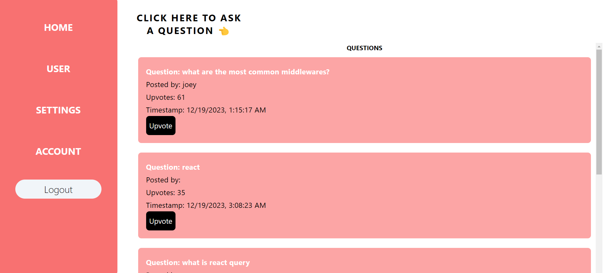

# Upvoter Application

## Table of Contents
- [About the Project](#about-the-project)
- [Screenshots](#screenshots)
- [Technologies Used](#technologies-used)
- [Setup / Installation](#setup--installation)
- [Usage](#usage)
- [Approach](#approach)
- [Status](#status)

## About the Project
This application allows users to ask questions or queries, the most liked question will automatically bubble up to the top. It is developed with React.js, JavaScript, React Query, Supabase, and Tailwind CSS. The application features signup and sign-in functions, utilizing Supabase for authentication and authorization.

## Screenshots

## Technologies Used
- React.js
- JavaScript
- React Query
- Supabase
- Tailwind CSS

## Setup / Installation
1. Clone the repository: `git clone [https://github.com/yourusername/yourrepository.git](https://github.com/Ganadhish7/upvoter-v1.git)`
2. Install dependencies: `npm install`
3. Start the development server: `npm run dev`

## Usage
Explain how to use the application, including any necessary steps to sign up, sign in, and ask questions or queries.

## Approach
Briefly describe the design patterns implemented and code styles used in the project.

## Status
Mention whether the project is completed or in progress.
